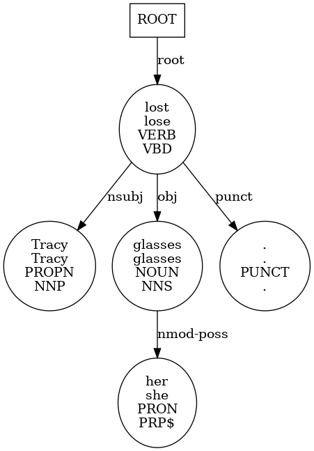
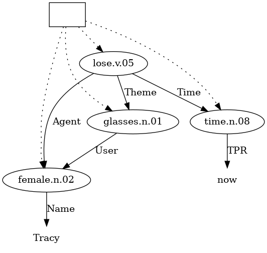

# UD-Boxer
This system is a syntax-semantics interface between Universal Dependencies (UD) and Discourse Representation Structures (DRS), as used in the Parallel Meaning Bank (PMB) project.
The primary DRS target format is the Simplified Box Notation (SBN).
The following images show the basic idea for the sentence **Tracy lost her glasses.** with the UD parse on the left and the target SBN graph on the right:

<table>
  <tr>
    <td></td>
    <td></td>
  </tr>
</table>

Note that the `thesis-hand-in-branch` is the branch that corresponds to the exact state of the system described my thesis.
Additional development will be done on other branches.
These changes will not be merged to the hand in branch!

## Resources
- Thesis: https://arts.studenttheses.ub.rug.nl/31168/1/master_thesis_wessel_poelman.pdf
- Peer-reviewed COLING-2022 paper about the system: https://aclanthology.org/2022.coling-1.367/

## Installation
A script with the required steps is included: `install.sh`.
Note however that this is to illustrate the steps needed, you probably need to edit it in order to work for your system.

1. Create and activate a virtual environment (Python 3.9.7 was used in development) (**Optional**)
2. Install `graphviz` to generate visualizations. (**Optional**)
   1. On Debian-based systems: `apt install graphviz libgraphviz-dev pkg-config`
3. Install GREW
   1. Follow the instructions on https://grew.fr/usage/install/ (NOTE: if you have trouble, make sure `ocamlbuild` is installed: `opam install ocamlbuild`)
   2. Make sure `opam` is active by running `opam --version`
   3. If `opam` is not avaible, try activating it with `eval $(opam env)`
4. Install dependencies with `pip install -r requirements/requirements.txt`
   1. `requirements/requirements-ud.txt` contains alternative UD parsing systems (**Optional**)
   2. `requirements/requirements-dev.txt` contains development libraries for testing, formatting etc. (**Optional**)

Run `fix_all.sh` to format and test the project (dev requirements needed).

## Data
The data comes from the Parallel Meaning Bank project (https://pmb.let.rug.nl/).
### Notes
- This project uses version 4.0.0 of the PMB dataset, which can be downloaded from here: https://pmb.let.rug.nl/data.php
- There are some minor issues with this version of the dataset that will be fixed in future versions:
  * There are several synset ids that contain whitespace
  * There are some empty `*.sbn` documents
  * There are several cyclic SBN graphs (they should all be Directed Acyclic Graphs (DAGs))
  * Some SBN files contain constants that cannot be distinguished from indices. For example: `en/silver/p15/d3131`
- Most of the docs with these issues are listed in the `misc` folder.
- The system warns or errors when it encounters these issues.

### Splits
The data splits only contain ids for gold data per language.
The splits are based on the `experiment` files in the PMB: `exp_data_4.0.0.zip` from https://pmb.let.rug.nl/releases/.

Note that not all docs are usable due to the above mentioned issues, so the actual counts are slightly lower.

| Split | English | Italian | German | Dutch |
| ----- | ------- | ------- | ------ | ----- |
| train | 7668    | 685     | 1738   | 539   |
| test  | 1048    | 461     | 547    | 491   |
| dev   | 1169    | 540     | 559    | 437   |
| eval  | 830     | -       | -      | -     |

### Structure
The PMB has a specific file structure that is handy to understand when using the system.
The `data/test_cases` directory has a similar layout and can be used to see what is happening.
What the specific files mean will be explained in the usage section.

```
<language-1> /
  <p-collection-1> /
    <document-1> /
      --- The existing PMB files per document ---
      <lang>.drs.clf
      <lang>.drs.sbn
      <lang>.drs.xml
      <lang>.met
      <lang>.parse.tags
      <lang>.raw
      <lang>.status
      <lang>.tok.iob
      <lang>.tok.off

      --- These items get added when using all options provided by main.py ---
      <lang>.ud.<ud-system>.conll
      <lang>.drs.penman
      <lang>.drs.lenient.penman
      viz /
        <lang>.drs.png
        <lang>.ud.<ud-system>.png

      --- Predictions from pmb_inference.py when using all options get stored here ---
      predicted /
        output.penman
        output.lenient.penman
        output.sbn
        output.png
    <document-2> /
    ...
  <p-collection-2> /
  ...
<language-2> /
...
```

## Usage
### From scratch
To transform a single sentence to DRS in SBN format, run:

```
python inference.py --sentence "Tracy lost her glasses." --output_dir ./result
```

This stores a `conll` file of the UD parse and the generated `sbn` file in `./result`.

---

If you already have a UD parse in `conll` format at hand, run:

```
python inference.py --ud <path-to-conll-file> --output_dir ./result
```
---

There are a number of additional tools and options included apart from the main graph transformations:

```
python inference.py \
  --sentence "Tracy lost her glasses." \
  --output_dir ./result \
  --store_visualizations \
  --store_penman
```

This stores an AMR-like output of the SBN in Penman notation as well as visualizations of the UD parse and the SBN graph.
The `*.drs.penman` file includes everything, the `*.drs.lenient.penman` file does not include the sense number.
The regular Penman output indirectly also targets word sense disambiguation when scoring the output (with SMATCH for instance).
The lenient option does not do this, but does reward correct lemmas and parts of speech for a given synset.

For more details and additional options, run `inference.py --help`.

### With normal PMB dataset
The PMB does not come with UD parses or SBN graphs in Penman notation.
The script `main.py` can be used to interact with the PMB to gather information, store required files, train certain components used for inference and generate visualizations.

```
python main.py --starting_path <path-to-pmb-dataset> \
  --store_ud_parses \
  --search_dataset \
  --extract_mappings \
  --error_mine \
  --store_visualizations \
  --store_penman
```

This will recursively go through all PMB docs, do all possible operations on the data and generate all required files to run inference.

For more details and additional options, run `main.py --help`.

### With enhanced PMB dataset
To store the results within the PMB dataset file structure and evaluate the generated output, you can use `pmb_inference.py`.

```
python pmb_inference.py -p data/test_cases -r results.csv
```

This will recursively go through the provided path, generate SBN graphs with the `conll` files it finds and compares these with the `.penman` file in the same folder.
It will store the predicted `.penman` files in the dataset and write the evaluation scores to `results.csv` for later analysis.

By default, the system will use 16 threads to go through the dataset and generate results.

---

Again, there are several additional options:

```
python pmb_inference.py -p <path-to-pmb-dataset> \
  --results_file results.csv \
  --max_workers 32 \
  --clear_previous \
  --store_visualizations \
  --store_sbn
```
This will go through the dataset with 32 workers, writing the results to `results.csv`, clearing previously predicted files if they exist, storing visualizations of the generated output as well the generated SBN itself.

For more details and additional options, run `pmb_inference.py --help`.

### Scoring
If you want to evaluate existing AMR-like (Penman) parses without running the whole inference pipeline, you can use SMATCH via `mtool` (which is included in the requirements):

```
mtool --read amr --score smatch --gold <path-to-gold> <path-to-test>
```

An example script on how to use this with SBN files is also included: `example_scripts/evaluate.py`.

## Notebooks
A number of notebooks have been used in the development and analysis of `ud-boxer`.
These also include some experiments and miscellaneous parts.
In order to not clog up this repository, these have been moved to their own repository.
This repo can be accessed as a git submodule in the current repo, as well has directly: https://github.com/WPoelman/ud-boxer-notebooks.

Note that you probably need to move the notebooks to the `ud-boxer` project root if they need access to `ud-boxer` components.
Another option is to change your Python path.
We will add the option to install `ud-boxer` as a package at a later moment.

## Possible future improvements
- [ ] Support enhanced UD annotations (need CoreNLP binding: https://stanfordnlp.github.io/CoreNLP/depparse.html or keep an eye on this: https://github.com/stanfordnlp/stanza/issues/359) these are essential for certain case markings.
- [ ] Generated SBN does not adhere to the spec entirely, in particular when it comes to constants. The evaluation in Penman notation is not bothered by this since everything gets consistently quoted there:
  - [ ] Names are not quoted properly with `"John Doe"`, now they are formatted as `John_Doe`. This requires keeping track of an additional flag/type indicating if something is a name. I am a bit hesitant to do this since we might introduce a NER component that will help with this a lot.
  - [ ] Year constants are not quoted properly like `'2022'`, now they are formatted as `2022`, again something for a possible NER component since date parsing in general is not ideal currently.

## Test cases
* **p00/d0004**: `entity` that combines multiple subtypes
* **p00/d0801**: multiple boxes
* **p00/d1593**: negation
* **p00/d2719**: case marking / pivot -> extended UD needed!
* **p03/d2003**: named entity 'components' combining in single item
* **p04/d0778**: double negation
* **p04/d1646**: connect owner
